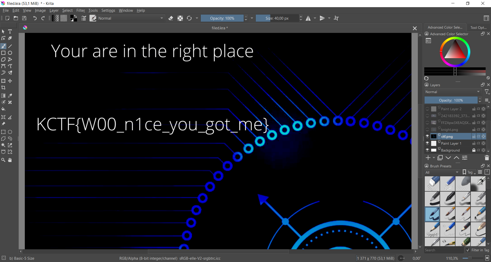

# FileD - Steganography
>***Can you see everything?.***
points: 25
This file turned out to be a Krita project. I opened it and checked each layer one by one until I came across a flag in the `ctf.png` file.


flag: 
```
KCTF{W00_n1ce_you_got_me}
```