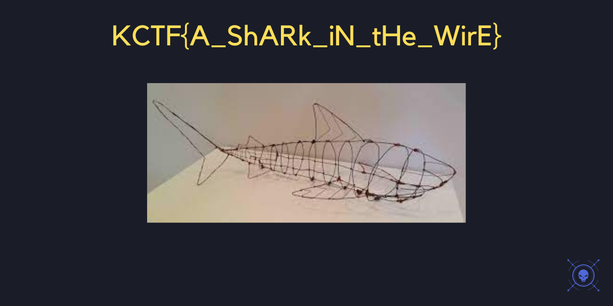

# How's the Shark? - Networking
>***Find the flag from the following.***
points: 25
I used Wireshark for this challenge and I export captured HTTP data inside data.pcapng file then I found an image with the name `something%20something.png ` in which was a flag.


flag: 
```
KCTF{A_ShARk_iN_tHe_WirE}
```